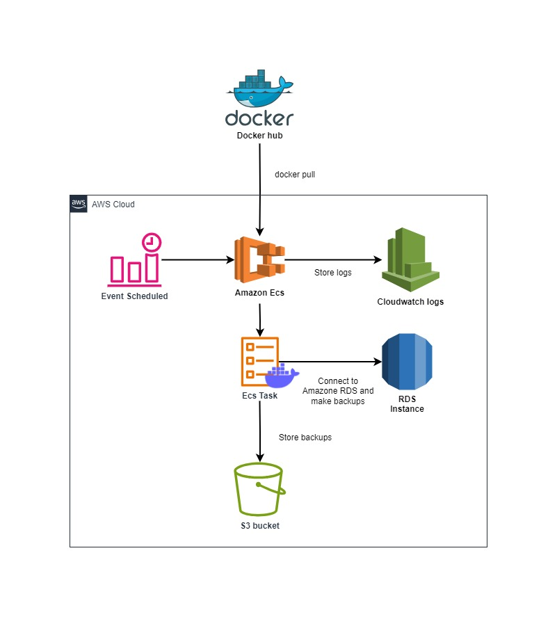

# AWS RDS Dump

Backup your database only from AWS RDS to S3.

## Motivation

AWS' backup solution for RDS presents challenges in terms of portability and customization. In practice, when looking
for flexibility or wanting to manipulate backups, the utilities developed for this purpose by database editors are often
more convenient than snapshots generated by AWS. That’s why we created `aws-rds-dump` to allow you to quickly and
confidently perform backups with the official tools for each database supported by RDS.

## Docker images

- [aws-rds-dump-mysql](https://hub.docker.com/repository/docker/adebayohountondji/aws-rds-dump-mysql)
- [aws-rds-dump-postgres](https://hub.docker.com/repository/docker/adebayohountondji/aws-rds-dump-postgres)

## Use case

Suppose you want to periodically export a specific table from your MySQL RDS database for analysis. In this case, the
use of mysqldump is unavoidable, because this operation is not possible with AWS backup solutions.

Here’s how to automate this process by integrating `aws-rds-dump` into your AWS environment.

## Developer guide

Please see [developer guide documentation](docs/developer.md) for more information.

## Releases

This project follows the Semantic Versioning convention ([https://semver.org](https://semver.org)) for version
numbering.

## Changelog

Please see [CHANGELOG](CHANGELOG.md) for more information on what has changed recently.

## Security

If you discover any security-related issues, please email mail@adebayo.fr instead of using the issue tracker.

## License

Please see [License File](LICENSE) for more information.
